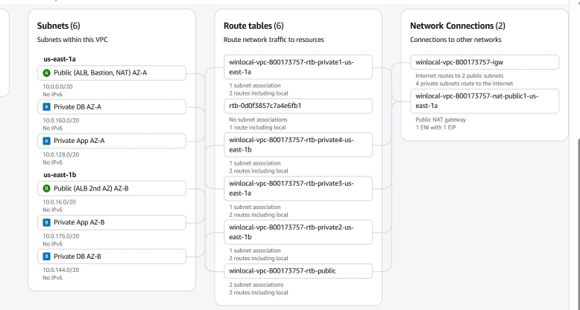
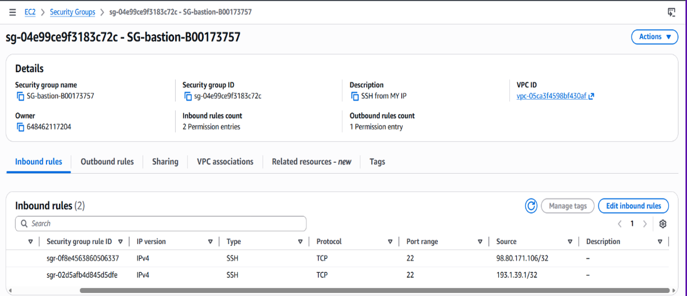
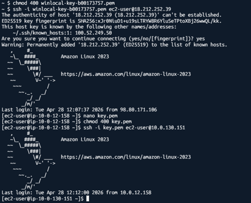
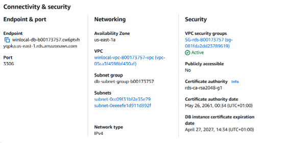
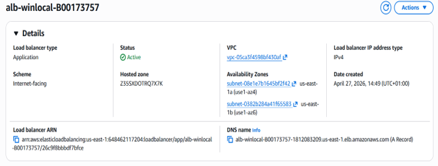
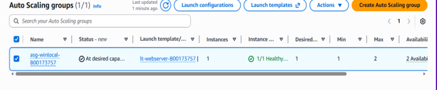
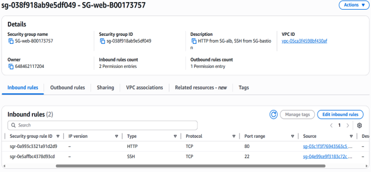
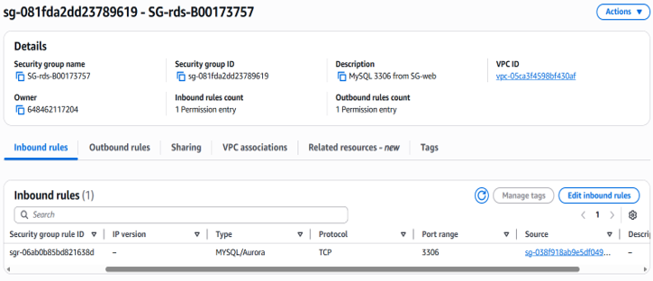

# AWS Secure Cloud Architecture

A cloud security architecture project built on Amazon Web Services to redesign a vulnerable environment following a ransomware incident.

The solution focused on network segmentation, controlled administrative access, private application and database tiers, resilience, scaling, and reducing lateral movement through layered AWS security controls.

**Technologies:** AWS, VPC, EC2, RDS MySQL, Application Load Balancer, Auto Scaling, S3, Security Groups, Bastion Host, NAT Gateway, Internet Gateway, Route Tables

## Project Overview

The project was based around a fictional company scenario called **WinLocal Giveaways**.

The company had suffered a ransomware attack that exposed weaknesses in its flat network. The goal was to design and implement a proof-of-concept AWS environment that improved security, resilience, availability, and scalability.

The environment included:

- One AWS VPC
- Two Availability Zones
- Public subnets
- Private application subnets
- Private database subnets
- Application Load Balancer
- EC2 web servers
- Bastion host
- Amazon RDS MySQL
- Auto Scaling
- Layered security groups

## Architecture

The VPC used segmented public, application, and database tiers across multiple Availability Zones.

Public-facing resources handled incoming and administrative traffic, while the web and database systems were kept inside private subnets.

## Bastion Host

Administrative access to private EC2 instances was routed through a bastion host located in the public subnet.

The bastion security group restricted SSH access to authorised administrative addresses only.

Private web servers were accessed through the bastion rather than being directly exposed to the internet.

## Private Web Tier

The web server was placed inside a private application subnet with no direct public IP address.

User traffic reached the application through the Application Load Balancer, reducing direct exposure of the EC2 instance.

## Amazon RDS

Amazon RDS MySQL was deployed inside the private database tier with public access disabled.

Only the web server security group was permitted to connect to the database on MySQL port 3306.

## Application Load Balancer

An Application Load Balancer was used as the public entry point for application traffic.

It distributed incoming requests to healthy web server instances and improved resilience compared with the original environment.

## Auto Scaling

An Auto Scaling Group was configured to maintain one web server under normal conditions and scale to an additional instance when demand increased.

This provided improved availability and helped the environment respond automatically to traffic spikes.

## Security Group Design

Separate security groups were used to control communication between each tier.

### Web Security Group

The private web server security group accepted:

- HTTP traffic from the Application Load Balancer
- SSH traffic from the bastion host

It was not directly exposed to the internet.

### RDS Security Group

The database security group permitted MySQL traffic on port 3306 only from the web server security group.

This kept the database isolated from direct user or internet access.

## Security Concepts Demonstrated

- Network segmentation
- Defence in depth
- Least privilege
- Bastion-host architecture
- Private application tiers
- Private database tiers
- Security group chaining
- Reduced attack surface
- Controlled lateral movement
- Load balancing
- Auto Scaling
- Multi-AZ design principles
- Cloud resilience

## Challenges Addressed

The architecture was designed to address several weaknesses in the original environment:

- Flat network architecture
- Ransomware propagation
- Direct system exposure
- Unreliable load balancing
- Database availability issues
- Traffic spikes
- Lack of automated scaling
- Limited separation between application and database systems

## Production Improvements

Additional services identified for a production version included:

- AWS WAF
- Amazon CloudWatch
- Route 53 DNS failover
- Multi-AZ RDS standby
- Additional NAT resilience

## What I Learned

This project provided hands-on experience with:

- Designing segmented AWS environments
- Building public and private subnet architectures
- Restricting traffic with security groups
- Securing administrative access through a bastion host
- Isolating databases from public access
- Configuring Application Load Balancing
- Using Auto Scaling for availability and demand handling
- Designing cloud systems around security and resilience requirementsaround security and availability requirements
